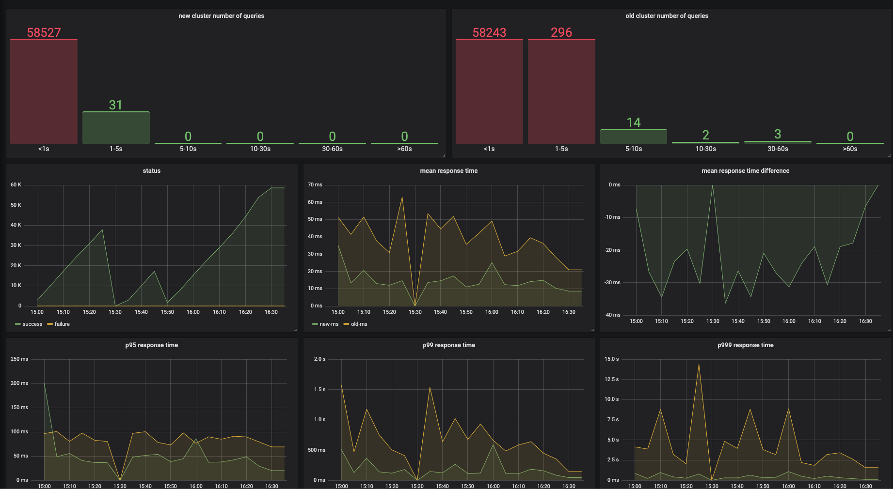

1. Start Kafka
2. Start Grafana/Carbon stack
3. Start Consul for configuration management [Optional] 
4. Load events to kafka
5. Start this service
6. Enjoy!

TODO  
Handle https://github.com/buger/goreplay format