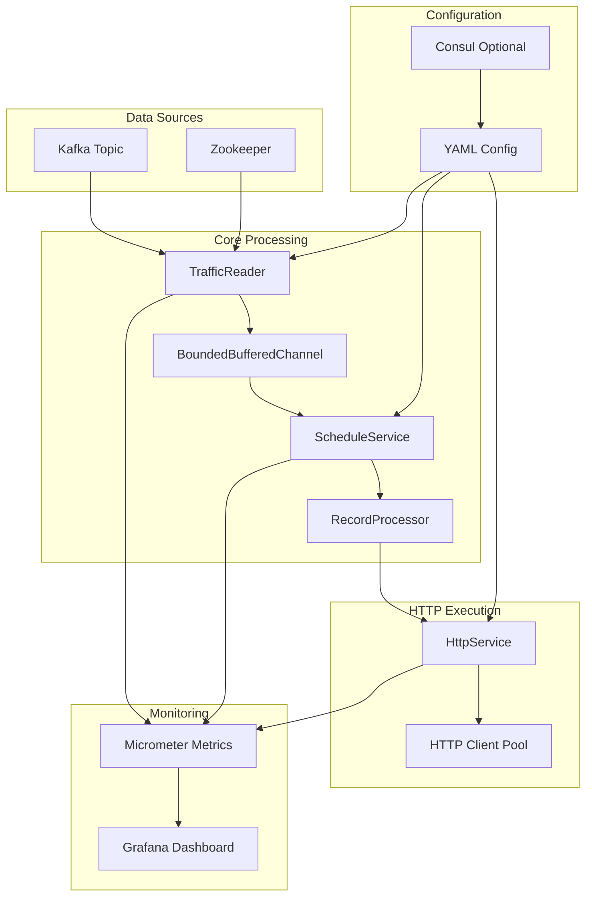

# Traffic Replay System

A high-performance, scalable traffic replay system designed to replay HTTP requests from Kafka topics with configurable timing, filtering, and processing capabilities. Built with Java 12, this system provides real-time traffic replay for load testing, performance analysis, and system validation.

## 🚀 Features

- **Real-time Traffic Replay**: Replay HTTP requests from Kafka topics with original timing or accelerated schedules
- **Configurable Scheduling**: Support for speedup factors, time-based filtering, and custom scheduling logic
- **Extensible Architecture**: Plugin-based processor system for different data formats (Druid, custom parsers)
- **High Performance**: Asynchronous processing with bounded channels and configurable thread pools
- **Comprehensive Metrics**: Built-in monitoring with Micrometer integration for StatsD and Graphite
- **Flexible Configuration**: YAML-based configuration with support for dynamic configuration via Consul
- **Docker Support**: Complete Docker Compose setup for development and testing

## 🏗️ Architecture

The system follows a modular architecture with clear separation of concerns:



### Core Components

- **TrafficReader**: Consumes records from Kafka topics and feeds them to processing channels
- **ScheduleService**: Manages request scheduling with configurable timing and speedup factors
- **RecordProcessor**: Extensible interface for parsing and processing different record formats
- **HttpService**: Handles HTTP request execution with configurable thread pools
- **Metrics**: Comprehensive monitoring with Micrometer integration

## 📦 Project Structure

```
traffic-replay/
├── core/                           # Core application module
│   ├── src/main/java/
│   │   └── com/gelerion/traffic/replay/core/
│   │       ├── channels/           # Async processing channels
│   │       ├── config/            # Guice dependency injection
│   │       ├── http/              # HTTP client implementation
│   │       ├── kafka/             # Kafka integration
│   │       ├── metrics/           # Metrics and monitoring
│   │       ├── service/           # Core services (scheduler)
│   │       └── utils/             # Utility classes
│   └── src/main/resources/
│       ├── application.yml        # Main configuration
│       └── log4j2.xml            # Logging configuration
├── processor-api/                 # Processor API module
│   └── src/main/java/
│       └── com/gelerion/traffic/replay/api/
│           ├── event/             # Event models
│           ├── model/             # Data models
│           ├── RecordProcessor.java
│           └── RecordProcessorProviderSPI.java
├── extensions/                    # Extension modules
│   └── druid-processor/          # Druid query log processor
└── _environment/                 # Development environment
    ├── dockers/                  # Docker Compose setup
    └── grafana/                  # Monitoring dashboards
```

## 🛠️ Setup & Installation

### Prerequisites

- Java 12+
- Maven 3.6+
- Docker & Docker Compose (for development environment)
- Kafka (for production)

### Quick Start

1. **Clone the repository**
   ```bash
   git clone <repository-url>
   cd traffic-replay
   ```

2. **Start the development environment**
   ```bash
   cd _environment/dockers
   docker-compose up -d
   ```

3. **Build the project**
   ```bash
   mvn clean install
   ```

4. **Configure the application**
   ```bash
   cp core/src/main/resources/application.yml core/src/main/resources/application-local.yml
   # Edit application-local.yml with your configuration
   ```

5. **Run the application**
   ```bash
   cd core
   mvn exec:java -Dexec.mainClass="com.gelerion.traffic.replay.core.TrafficReplyApplication"
   ```

### Development Environment

The project includes a complete Docker Compose setup for development:

```bash
# Start Kafka and Zookeeper
cd _environment/dockers
docker-compose up -d

# View logs
docker-compose logs -f
```

## ⚙️ Configuration

### Core Configuration (`application.yml`)

```yaml
general:
  test-id: "my-test-name"  # Acts as Kafka group-id

zk:
  url: "zookeeper:2181"

kafka:
  topics: "kafka-topic"
  use-timestamp-seek: false

channel:
  capacity: 100

scheduler:
  speedup-factor: 10
  query-cutoff-time: "2019-10-28T00:00:00.000Z"
  scheduling-start-time: "2019-12-26T15:37:00.000+02:00[Asia/Jerusalem]"
  core-pool-size: 2
  max-scheduled-tasks: 50000

http:
  service:
    log-response-body: true
  client:
    threads: 60

extensions:
  provider:
    name: "druid"

druid:
  url: "http://broker-url/druid/v2"
  parser: "druid-query-log"
```

### Key Configuration Parameters

- **`speedup-factor`**: How much faster to replay requests (10x = 10x faster than original)
- **`query-cutoff-time`**: Only replay requests after this timestamp
- **`scheduling-start-time`**: When to start scheduling requests
- **`core-pool-size`**: Number of scheduler threads
- **`max-scheduled-tasks`**: Maximum number of concurrent scheduled tasks

## 🔌 Extensions & Processors

### Creating Custom Processors

The system supports custom record processors through the SPI (Service Provider Interface):

1. **Implement RecordProcessor interface**:
   ```java
   public class CustomRecordProcessor implements RecordProcessor<CustomEvent> {
       @Override
       public CustomEvent parse(String record) {
           // Parse your record format
       }
       
       @Override
       public Request runFn(CustomEvent event) {
           // Build HTTP request
       }
   }
   ```

2. **Register your processor**:
   Create `META-INF/services/com.gelerion.traffic.replay.api.RecordProcessorProviderSPI` with your provider class.

### Built-in Processors

- **Druid Processor**: Processes Druid query log format
  - Supports query log parsing
  - Configurable URL and parser type
  - Built-in filtering and validation

### Processor API Reference

The `RecordProcessor` interface provides a flexible way to process different record formats:

```java
public interface RecordProcessor<E extends Event> {
    // Main processing pipeline
    default Stream<EventAndRequest> process(String record) {
        return Stream.of(record)
                .map(this::parse)
                .filter(this::filter)
                .map(this::edit)
                .map(event -> EventAndRequest.of(event, runFn(event)));
    }
    
    // Parse raw record into typed event
    E parse(String record);
    
    // Filter events (default: accept all)
    default boolean filter(E event) {
        return true;
    }
    
    // Modify event before execution (default: no changes)
    default E edit(E event) {
        return event;
    }
    
    // Build HTTP request from event
    Request runFn(E event);
}
```

### Event Model

Events must implement the `Event` interface and can extend `Timestamped` for scheduling:

```java
public interface Event {
    // Base event interface
}

public interface Timestamped extends Event {
    Instant getTimestamp();
}

public interface HasResponseTime extends Event {
    Duration getResponseTime();
}
```

## 📊 Monitoring & Metrics

The system provides comprehensive metrics through Micrometer:

### Key Metrics

- **Kafka Consumer**: `kafka.consumer.consumed` (histogram), `kafka.consumer.produced` (counter)
- **HTTP Client**: Request/response metrics, latency, error rates
- **Scheduler**: Task scheduling and execution metrics
- **Channel**: Buffer utilization and throughput

### Grafana Dashboard

A pre-configured Grafana dashboard is included in `_environment/grafana/dashboard.json`:

```bash
# Import the dashboard into Grafana
# The dashboard includes:
# - HTTP request/response metrics
# - Kafka consumer metrics
# - System performance metrics
# - Error rate monitoring
```

## 🚀 Usage Examples

### Basic Traffic Replay

```bash
# Start with default configuration
java -jar core/target/core-1.0-SNAPSHOT.jar
```

### Custom Configuration

```bash
# Use custom configuration file
java -jar core/target/core-1.0-SNAPSHOT.jar --spring.config.location=application-custom.yml
```

### Environment Variables

```bash
# Override configuration with environment variables
export KAFKA_TOPICS="my-topic"
export SPEEDUP_FACTOR="5"
java -jar core/target/core-1.0-SNAPSHOT.jar
```

### Advanced Configuration Examples

#### High-Throughput Setup

```yaml
# application-high-throughput.yml
general:
  test-id: "high-throughput-test"

kafka:
  topics: "traffic-topic"
  use-timestamp-seek: true

channel:
  capacity: 50000

scheduler:
  speedup-factor: 50
  core-pool-size: 50
  max-scheduled-tasks: 200000

http:
  client:
    threads: 500
  service:
    log-response-body: false

# Disable response body logging for performance
```

#### Development Setup

```yaml
# application-dev.yml
general:
  test-id: "dev-test"

kafka:
  topics: "dev-traffic"
  use-timestamp-seek: false

channel:
  capacity: 100

scheduler:
  speedup-factor: 1  # Real-time replay
  core-pool-size: 2
  max-scheduled-tasks: 1000

http:
  client:
    threads: 10
  service:
    log-response-body: true  # Enable for debugging

# Enable detailed logging
logging:
  level:
    com.gelerion.traffic.replay: DEBUG
```

#### Production Setup

```yaml
# application-prod.yml
general:
  test-id: "prod-load-test"

kafka:
  topics: "production-traffic"
  use-timestamp-seek: true

channel:
  capacity: 20000

scheduler:
  speedup-factor: 10
  query-cutoff-time: "2024-01-01T00:00:00.000Z"
  scheduling-start-time: "2024-01-15T09:00:00.000Z"
  core-pool-size: 20
  max-scheduled-tasks: 100000

http:
  client:
    threads: 200
  service:
    log-response-body: false

# Production monitoring
metrics:
  statsd:
    enabled: true
    host: "statsd-server"
    port: 8125
```

## 🔧 Development

### Building from Source

```bash
# Build all modules
mvn clean install

# Build specific module
mvn clean install -pl core

# Skip tests
mvn clean install -DskipTests
```

### Running Tests

```bash
# Run all tests
mvn test

# Run specific test class
mvn test -Dtest=TrafficReaderTest
```

### Code Style

The project follows standard Java conventions with:
- Java 12 features
- Lombok for reducing boilerplate
- Guice for dependency injection
- Comprehensive logging with SLF4J

## 📈 Performance Tuning

### Key Performance Parameters

- **`channel.capacity`**: Buffer size for processing pipeline
- **`scheduler.core-pool-size`**: Number of scheduler threads
- **`http.client.threads`**: HTTP client thread pool size
- **`scheduler.max-scheduled-tasks`**: Maximum concurrent tasks

### Recommended Settings

For high-throughput scenarios:
```yaml
channel:
  capacity: 10000

scheduler:
  core-pool-size: 20
  max-scheduled-tasks: 100000

http:
  client:
    threads: 200
```

## 🐛 Troubleshooting

### Common Issues

1. **Kafka Connection Issues**
   - Verify Kafka is running: `docker-compose ps`
   - Check topic exists: `kafka-topics --list --bootstrap-server localhost:9092`

2. **High Memory Usage**
   - Reduce `channel.capacity`
   - Decrease `max-scheduled-tasks`
   - Monitor with JVM metrics

3. **Slow Processing**
   - Increase `http.client.threads`
   - Adjust `core-pool-size`
   - Check network latency

### Debugging

Enable debug logging:
```yaml
logging:
  level:
    com.gelerion.traffic.replay: DEBUG
```